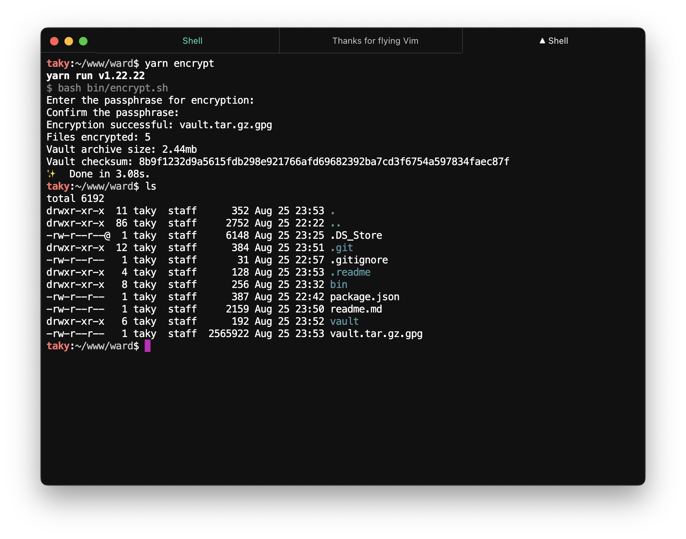
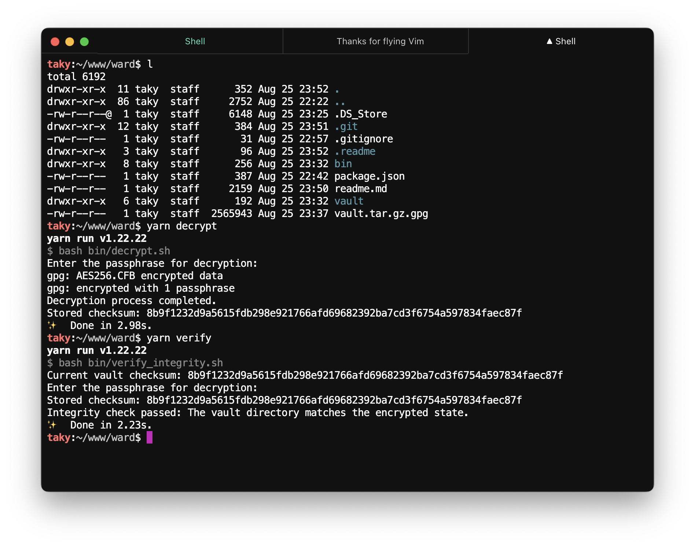
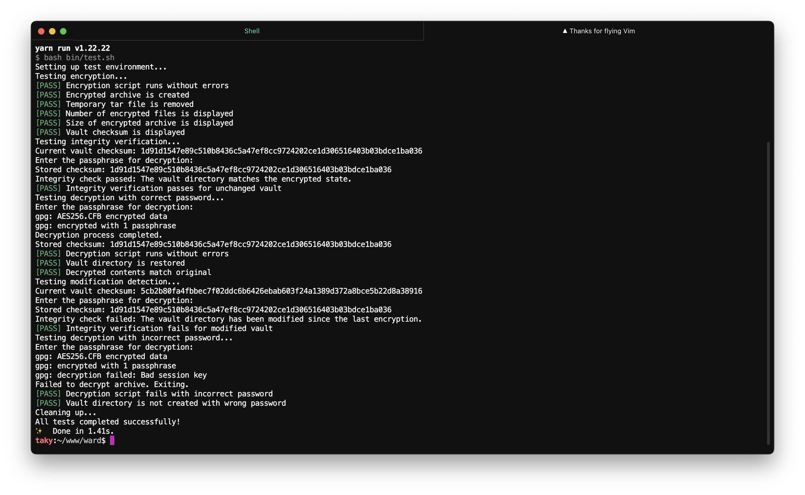

# ward: a personal vault

ward is a bunch of bash scripts that will keep your secret files safe but also as accessible as you'd like. i designed it to use it dangerously within git.
consider it digital safe for your sensitive files. it encrypts your stuff, keeps it integrity-checked, it is written in bash and it's pretty straightforward:

- encrypts your files using gpg
- lets you check if someone's messed with your encrypted stuff
- generates totp codes if you're storing those sorts of secrets and need to recover accounts

## prereqs

make sure you've got these installed:

- gpg
- oath-toolkit (for totp)
- bc (basic math and comes with most systems)

## getting started

1. install the essentials:
```
# ubuntu/debian
sudo apt-get install gnupg oath-toolkit bc

# osx/homebrew
brew install gnupg oath-toolkit
```

2. clone the repository
```
git clone https://github.com/oeo/ward.git
cd ward
```

3. decrypt the example vault.tar.gz.gpg
```
yarn decrypt # or ./bin/decrypt.sh
```

the default vault decryption password is `letmein`.

## simple usage


```
mkdir vault
echo 123 > vault/123.txt
yarn encrypt # or ./bin/encrypt.sh
```

here are the yarn commands you'll be using:

- `yarn encrypt`: encrypt your vault directory
- `yarn decrypt`: decrypt your encrypted vault file
- `yarn verify`: verify the checksum of your vault
- `yarn totp <totp_secret>`: generate a totp code using a secret
- `yarn test`: run unit tests

### vaulting your files

1. throw whatever you want to encrypt into a folder called `vault`
2. run `yarn encrypt`
3. type in a passphrase
4. boom, you've got yourself an encrypted `vault.tar.gz.gpg`

### getting your stuff back

1. make sure `vault.tar.gz.gpg` is where it should be
1. run `yarn decrypt`
1. enter your passphrase
1. your files will pop back into the `vault` folder

### integrity verification


run `yarn verify` to ensure the archive hasn't been tampered with

### two-factor auth functionality
```
yarn totp <totp_secret>
```

### running tests


```
yarn test
```

## notes

- the `vault` folder doesn't self-destruct after encryption, clean up if you're paranoid
  - although it is included in the .gitignore, of course

## environment variables

if you're feeling lazy and a bit risky you can set `WARD_PASSPHRASE` in your environment.

## license

mit

